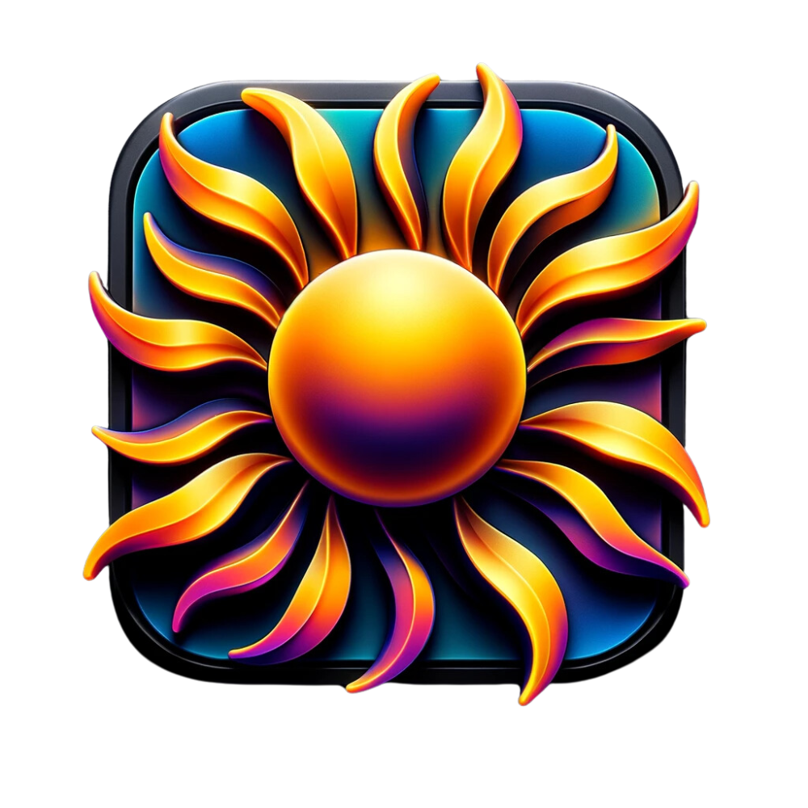

# Mac Brightness Boost
## The Ultimate Brightness Control Tool for MacOS

    

Welcome to **Brightness Boost**, a key utility in the MacUtilities suite - the definitive solution for managing screen brightness on MacOS. Whether you're looking to enhance your viewing experience or save energy, Brightness Boost offers intuitive controls and advanced features for all your screen brightness needs.

    

- - - - - - - - - - - - - - - - - - - - - - - - - - - - - - - - - - - - - - - - - - - - - - - -
-

### **Explore More on Our [Official MacUtilities Website](https://macutilities.org)**

- - - - - - - - - - - - - - - - - - - - - - - - - - - - - - - - - - - - - - - - - - - - - - - -
-

### 🌟 **Key Features of Brightness Boost:**

#### 💡 **Screen Brightness Control**
- **Instant Brightness Adjustment**: Easily adjust screen brightness.
- **Scheduled Brightness**: Automate brightness levels based on time of day.
- **Multi-Monitor Support**: Manage brightness across multiple screens.

#### 🌓 **Automatic Mode**
- **Light Sensor Integration**: Adjust brightness based on ambient light.
- **Day/Night Settings**: Automatically switch settings for day and night.
- **Energy Saving Mode**: Optimize brightness to save energy.

#### 🎨 **Customization**
- **Color Temperature Adjustment**: Tailor screen warmth for eye comfort.
- **Custom Profiles**: Create personalized brightness settings.
- **Keyboard Shortcuts**: Quick brightness adjustments at your fingertips.

---

### ⚙️ **Advanced Settings and Customizations:**

Click to Expand

1. **Screen Calibration**: Fine-tune your display for optimal viewing.
2. **Gamma Correction**: Adjust gamma settings for better contrast.
3. **Flicker-Free Settings**: Reduce screen flickering.
4. **Blue Light Filter**: Protect your eyes from harmful blue light.
5. **Brightness Sync**: Synchronize settings across devices.
6. **Hotkey Customization**: Set up custom shortcuts for easy control.
7. **Startup Behavior**: Configure Brightness Boost to launch at startup.
8. **Multi-Language Support**: Use Brightness Boost in various languages.
9. **OLED Screen Support**: Specialized settings for OLED displays.
10. **Remote Control**: Adjust brightness from your phone or tablet.
11. **HDR Enhancements**: Enhance High Dynamic Range settings.
12. **Contextual Profiles**: Change settings based on running applications.
13. **Battery Saver Mode**: Optimize brightness for battery longevity.
14. **Automatic Updates**: Stay up-to-date with the latest features.
15. **Usage Statistics**: Monitor your brightness adjustment patterns.
16. **Accessibility Features**: Enhanced support for visual impairments.
17. **Widget Support**: Quick access widgets for your desktop.
18. **Screen Saver Integration**: Adjust brightness when screen saver activates.
19. **Contrast Adjustment**: Fine-tune screen contrast levels.
20. **User Feedback Integration**: Share your experience and suggestions.

---

### 📦 **Installation Options for Mac Recorder:**

Mac Recorder can be downloaded as a standalone application or as part of the comprehensive MacUtilities suite, which includes tools for system cleaning, fan boosting, and much more.

### 📦 **Installation Options for Brightness Boost:**

Brightness Boost can be downloaded as a standalone application or as part of the comprehensive MacUtilities suite, which includes tools for screen recording, fan boosting, and system cleaning.

- **Install via Homebrew**:
    - For Brightness Boost Only: `brew install --cask mac-brightness-boost`
    - For the Full Mac Utilities Suite: `brew install --cask mac-utilities`

- **Download Via Direct Link**
  - Mac Recorder Only - [Download](https://github.com/TheOneStudioLLC/Mac-Brightness-Boost/releases/download/1.0/mac-brightness-boost.dmg)
  - Full Mac Utilities Suite - [Download](https://github.com/TheOneStudioLLC/Mac-Utilities/releases/download/1.0/mac-utilities.dmg)

- **Download Via App Store** (Limited Version)
  - Brightness Boost Only - [Link](#download-link)
  - Full Mac Utilities Suite - _Currently Unavailable_

---

### 🐞 **Bug Reporting and Feature Requests:**

- **Report Bugs**: Help us improve by reporting issues. [Report a Bug](https://macutilities.org/report-bugs)
- **Request Features**: Share your ideas for new features. [Request a Feature](https://macutilities.org/request-feature)

---

### 💬 **Community and Support:**

- **FAQs**: Get answers to common questions. [Read FAQs](https://macutilities.org/faq)
- **Customer Support**: Contact us for assistance. [Contact Support](https://macutilities.org/support)

---

### 🗓️ **Release History and Updates:**

- Explore our development journey. [View Release History](https://github.com/TheOneStudioLLC/Mac-Brightness-Boost/releases)

---

### 🌐 **Contribute to Localization:**

- **Join Our Translation Team**: Help localize Brightness Boost. [Contribute to Localization](#localization-contribution-link)

---

**Brightness Boost**, as a vital part of the MacUtilities suite, empowers you with full control over your screen brightness, optimizing your MacOS experience for both work and leisure.
